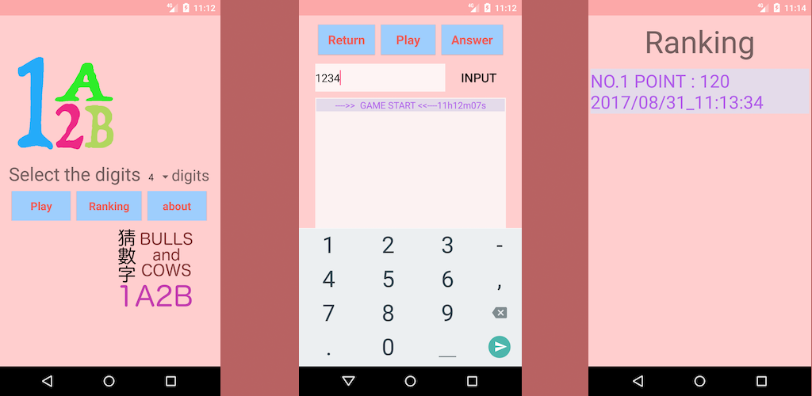
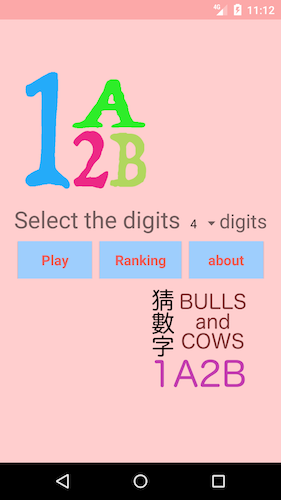
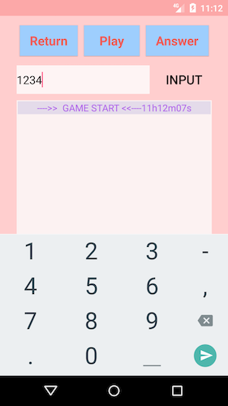
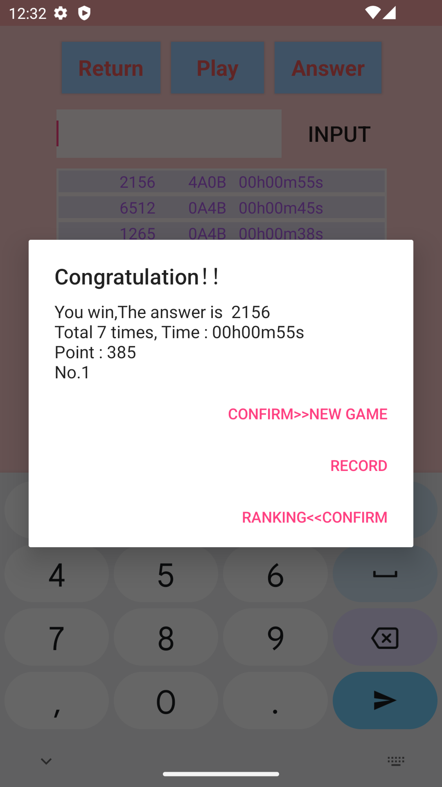

## 自製遊戲 1A2B猜數字 (1A2B Bulls And Cows)

>哈囉！我是一個很菜的開發人員，原本學java的，就想說自己來學一點安卓，這個猜數字遊戲原本是練習用的，但是看到它沒有完成，就把它做完整點．很多的幫助都是從網路上學來的，還有很多不足的地方，還請大家多多見諒．如果有什麼建議或感想，留個言唄！
### 特色
* 本地排行
* 隨機數字
* 上架Play商店(目前已下架)
* [Dcard #自製遊戲 1A2B猜數字](https://www.dcard.tw/f/game/p/227138031?cid=A6DE2638-F8DF-4A69-9ED2-36499ECED0A2)

## 預覽
* 首頁   
* 1A2B   
* 結果   
* 排行   